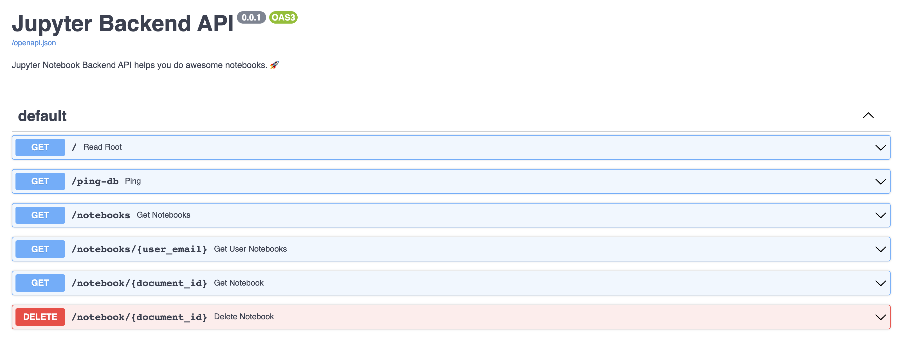

This is the API for a lightweight version of Jupyter notebooks built using FastAPI and MongoDB. It allows users to create, read, update, and delete Python notebooks and execute Python code within these notebooks. It's designed to be simple and intuitive, making it easy for anyone to run Python code in an interactive manner ✨


## Contributing

You can use the environments created by `tox` for development. From the root of the repository run

```shell
tox --notest -e unit
source .tox/unit/bin/activate
```

### Setup the database endpoint

Create a `.env` file with the [database connection string](https://www.mongodb.com/docs/guides/atlas/connection-string/) under the `src` directory

```bash
echo "MONGO_CONNECTION_STRING=<your database connection string>" > src/.env
```

### Start the development server

Go into the `src` directory

```bash
cd src
```

Start the development server

```bash
uvicorn main:app --reload
```

### Swagger UI

You can access the Swagger UI by going to http://localhost:8000/docs

### Testing

This project uses `tox` for managing test environments. There are some pre-configured environments
that can be used for linting and formatting code when you're preparing contributing.

```shell
tox -e lint          # code style
tox -e static        # static analysis
tox -e unit          # unit tests
tox -e integration   # integration tests
```

### GitHub CI

Tests will automatically run on Pull Request.